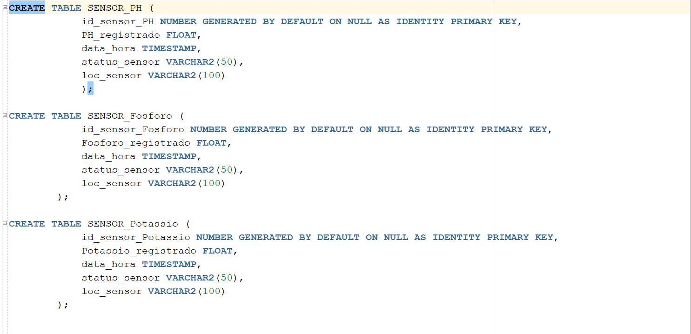

# Aplicação Python com Conexão Oracle

Este projeto é uma aplicação Python que realiza a conexão com um banco de dados Oracle utilizando o módulo `oracledb`.

## 📦 Requisitos

- Python 3.7 ou superior
- Oracle Client (opcional, mas recomendado para modo "thick")
- Módulo `oracledb`

# Faça em um ambiente virtual:
python -m venv venv

Windows:
venv\Scripts\activate

Linux/Mac:
source venv/bin/activate

# Dependências:
pip install oracledb

# Banco de dados
Foi criado um banco de dados Oracle simulando a captação de registros de sensores.

