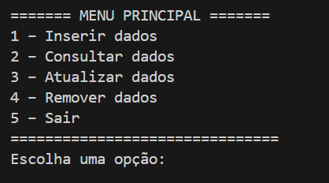
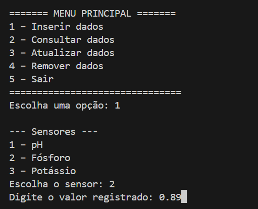
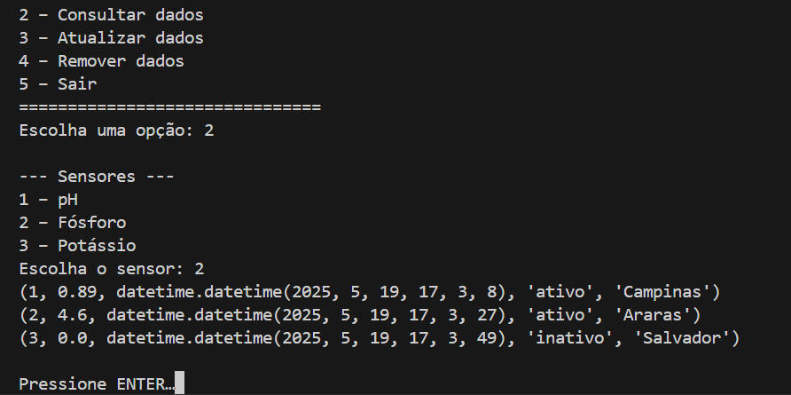

# Aplicação Python com Conexão Oracle

Esta é uma aplicação Python que realiza a conexão com um banco de dados Oracle utilizando o módulo `oracledb`.
Além disso, a aplicação contém um menu que permite operações CRUD de inserção, consulta, alteração e exclusão de dados.

## 📦 Requisitos

- Python 3.7 ou superior
- Oracle Client (opcional, mas recomendado para modo "thick")
- Módulo `oracledb`

### Dependências:
pip install oracledb

# Banco de dados
Foi criado um banco de dados Oracle para a captação de registros de sensores.

# Aplicação
A aplicação tem um menu para manipulação dos valores obtidos nos sensores.

Opção de Inserção

Opção de Consulta

