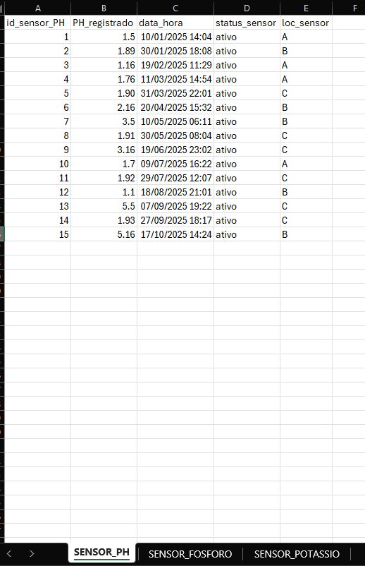
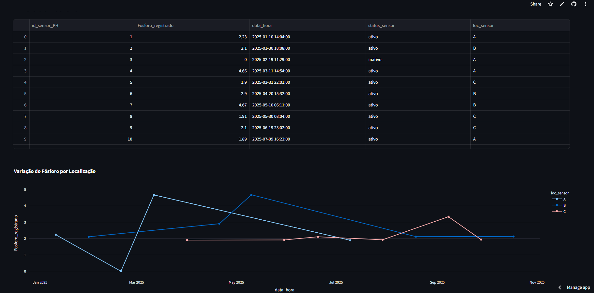

# Aplicação Python Conectada ao Streamlit Cloud

Desenvolvemos uma aplicação Python simples, conectada ao Streamlit Cloud.
A aplicação permite subir dados especificos de sensores e realiza análises gráficas.
Como exemplo e modelo utilizamos o arquivo excel "dados_usados_exemplo.xlsx"

  

  
## ✔ Requisitos e Dependências:

Estão no arquivo "requirements.txt"
- streamlit
- pandas
- openpyxl
- plotly

## Aplicação:
- Acesse o site/link: https://iralem1-bwijfxac6pnyejvlgecic7.streamlit.app
- Suba um excel comforme o formato de dados_usados_exemplo.xlsx.
- Será gerado uma análise visual automaticamente dos dados de Sensores.

  

  

## Vantagens:
### Simples, objetivo e claro para todos. Facilitando a análise da situação e das métrica dos sensores.
