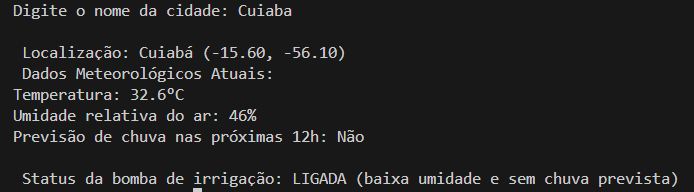

# Aplicação Python Conectada a APIs Metereológicas

Essa aplicação conecta ao serviços de meteorologia open-meteo, realiza uma busca com base em latitude e longitude. 
Retorna a Temperatura, Umidade e Previsão de Chuva nas próximas 12 horas.
Levando em conta a Umidade e a previsão de chuva do local, a aplicação decide se ativa ou não o sistema de irrigação.
  
## Requisitos e Dependências:

Está no arquivo "requirements.txt"
- requests
  
## 🌧 Aplicação:
- Usuário escreve o nome de uma cidade.
- São retornados os dados meteorológicos.
- O sistema escolhe se ativa ou não a bomba de irrigação.

  

